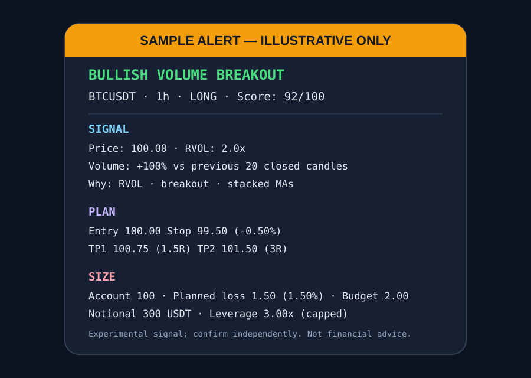

# Trade Alerts

[](https://github.com/itstofi/trade-alerts/actions/workflows/ci.yml)

A scheduled cryptocurrency market scanner that ranks liquid USDT pairs, evaluates closed candles on three timeframes, and sends the strongest qualified setups to Telegram.

> **Experimental project — not a validated trading system.** Signals have not been backtested or independently validated and may be late, wrong, or unprofitable. This repository is educational software, not financial advice.



## What it actually scans

On each run, the scanner:

1. Probes `api.binance.com`; if unavailable, it falls back to `api.binance.us`.
2. Fetches all 24-hour tickers and keeps `USDT` pairs above the exchange-specific volume floor, excluding stablecoin bases and an exact curated set of Binance leveraged-token symbols. The exact-symbol rule filters products such as `BTCUPUSDT` without incorrectly excluding spot assets such as `JUPUSDT` or `SUPERUSDT`.
3. Sorts those pairs by 24-hour **quote volume** and scans the top 200 above 5 million USDT on Binance global. The US fallback uses the top 50 above 25,000 USDT because its market is smaller.
4. Fetches 100 candles for `15m`, `1h`, and `4h`, discards the still-open candle, and computes moving averages, ATR, relative volume, candle structure, and prior 20-candle highs/lows. RVOL divides the current closed candle's volume by the mean of the **previous** 20 closed candles; the current candle is excluded from its own baseline.
5. Applies an early `2.0x` relative-volume filter, then requires a score of at least 80/100.
6. Keeps only the best timeframe for each symbol **within that run**, sorts by score, and sends at most five alerts.

Per-run deduplication does not persist across separate scheduled runs.

## Score model

The score is rule-based rather than predictive:

| Component | Maximum | What contributes |
|---|---:|---|
| Relative volume | 30 | RVOL tiers plus three consecutively rising volumes |
| Candle momentum | 25 | Body/range strength and a close near the directional extreme |
| Breakout / position | 20 | Close beyond the prior 20-candle range, or partial credit above/below MA28 and EMA50 |
| Trend alignment | 15 | Directional stacking of MA7, MA14, and MA28 |
| ATR expansion | 10 | Candle body size relative to ATR14 |

The direction comes from the latest closed candle. Qualified alerts are labeled as a volume breakout/breakdown, pullback rejection, high-volume momentum candle, or possible reversal with volume.

## Risk model and assumptions

The alert is a mechanical illustration, not an order:

- Entry is the latest closed-candle price.
- The stop sits `0.3 × ATR14` beyond the latest candle or the preceding five-candle swing, whichever is farther away.
- Setups with stops tighter than 0.3% or wider than 12% are rejected.
- Position sizing starts with a configurable 2% risk budget and applies a 3× leverage cap. The alert's **planned loss** is always `actual notional × stop distance`; when the cap prevents using the full budget, the smaller planned loss and the original risk budget are both shown.
- Targets are 1.5R and 3R; the message suggests taking 50% at TP1 and moving the stop to break-even.
- Fees, slippage, funding, liquidity, taxes, exchange constraints, and execution failure are not modeled.

## Architecture

```text
scanner.py              network access, indicators, orchestration, Telegram
trade_alerts/core.py    deterministic filtering, scoring, risk, dedupe, formatting
tests/                  offline unit and mocked scanner tests
```

Separating deterministic rules from I/O makes core behavior fast to test without credentials or network access.

## Setup

Requires Python 3.12.

```bash
python -m venv .venv
source .venv/bin/activate
python -m pip install -r requirements.txt
python scanner.py
```

Without Telegram credentials, delivery is skipped and a sanitized warning is logged. Runtime configuration uses:

| Environment variable / GitHub secret | Purpose | Default |
|---|---|---:|
| `TELEGRAM_TOKEN` | Telegram bot token | unset |
| `TELEGRAM_CHAT_ID` | Destination chat ID | unset |
| `ACCOUNT_USDT` | Hypothetical account value used for sizing | `100` |

To configure GitHub Actions, add the same three values under **Settings → Secrets and variables → Actions**, enable workflows, then use **Run workflow** for a manual scan.

## Scheduling

The preserved GitHub Actions schedule runs every 15 minutes (`*/15 * * * *`, UTC) and also supports manual `workflow_dispatch`. GitHub cron is best-effort and may be delayed. A workflow concurrency group queues runs instead of allowing overlapping scans. Scheduled/manual scanning remains separate from push/pull-request CI: scan runs install runtime dependencies and can use Telegram/account secrets, while CI runs lint, formatting, and offline tests and cannot send alerts. Official actions are pinned to reviewed commit SHAs.

A heartbeat is sent during the first scan between 08:00 and 08:14 UTC each day. Because scheduling is best-effort, a delayed run can miss that window.

## Development

Install pinned runtime and test dependencies, then run the same checks as CI:

```bash
python -m pip install -r requirements-dev.txt
ruff check .
pytest -q
python -m py_compile scanner.py trade_alerts/core.py
```

Tests cover exact leveraged-token filtering, malformed ticker data, shifted RVOL, bullish and bearish scoring/risk, inclusive stop boundaries, leverage-capped loss reporting, sanitized Telegram failure handling, successful-delivery counts, alert formatting, and per-run signal deduplication without live network access.

## License

MIT — see [LICENSE](LICENSE).
